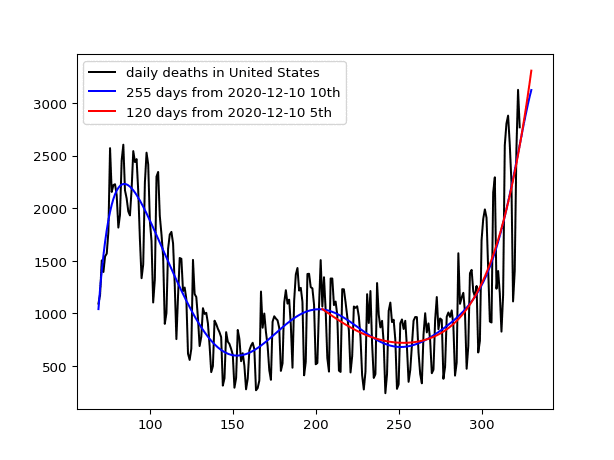

# US

In order to run Python programs, see the following site for novice to install the necessary libraries:
https://github.com/ytakefuji/python-novice

 X-axis is the xth day from Jan.22 2020 to Feb.27 2021. Y-axis depicts the number of daily deaths in the US due to the COVID-19.

The new_deaths.csv is created from the following site:

https://raw.githubusercontent.com/owid/covid-19-data/master/public/data/jhu/new_deaths.csv

